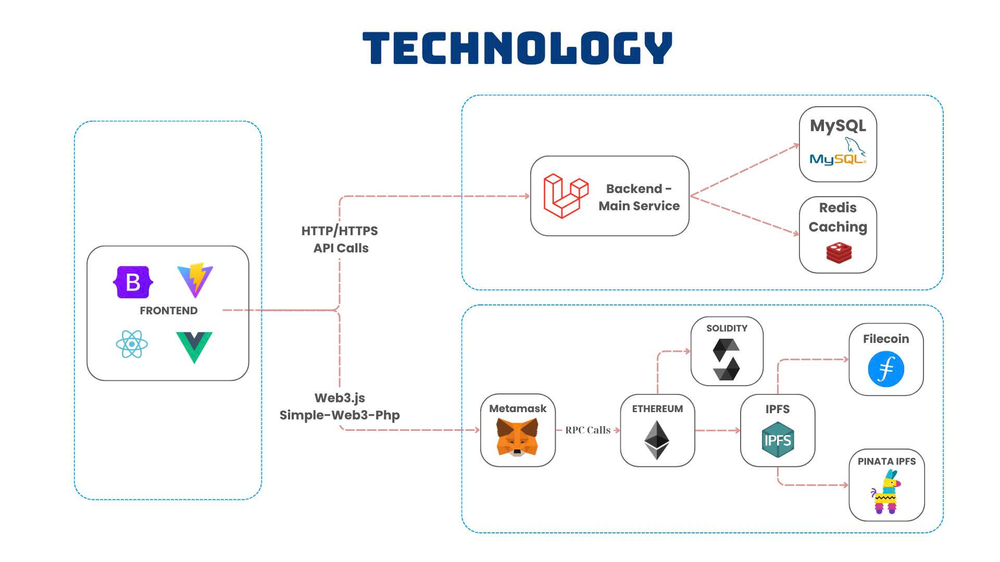

# AgriTrace System Architecture

## 🏗️ System Overview

AgriTrace is designed as a multi-layer architecture combining mobile, web, and backend technologies to create a comprehensive agricultural product traceability platform for Vietnamese farmers and consumers.

## 🔄 Detailed Process Flows

### 1. User Authentication & Data Management Flow

| Step | From | To | Activity |
|------|------|----|----------|
| 1 | Mobile App/Web | Backend API | Send Login/CRUD requests via HTTPS |
| 2 | Backend API | Redis | Check session cache |
| 3 | Redis | Backend API | Return cache hit/miss result |
| 4 | Backend API | MySQL/PostgreSQL | Execute SQL queries (if cache miss) |
| 5 | MySQL/PostgreSQL | Backend API | Return user data |
| 6 | Backend API | Mobile App/Web | Return JSON response |

### 2. Product Batch Creation Flow

| Step | From | To | Activity |
|------|------|----|----------|
| 1 | Mobile App | Backend API | Send batch creation request with product details |
| 2 | Backend API | Database | Store batch information |
| 3 | Backend API | QR Service | Generate unique QR code |
| 4 | QR Service | Backend API | Return QR code image and data |
| 5 | Backend API | File Storage | Save product photos |
| 6 | Backend API | Mobile App | Return batch details and QR code |

### 3. QR Code Scanning Flow

| Step | From | To | Activity |
|------|------|----|----------|
| 1 | Consumer Camera | QR Scanner | Scan QR code from product |
| 2 | QR Scanner | Backend API | Decode QR and fetch product data |
| 3 | Backend API | Database | Retrieve batch information |
| 4 | Database | Backend API | Return product details |
| 5 | Backend API | Consumer Browser | Display product information page |
| 6 | Consumer Browser | Backend API | Submit rating/review (optional) |

### 4. File Storage & Management Flow

| Step | From | To | Activity |
|------|------|----|----------|
| 1 | Mobile App | Backend API | Upload product photos |
| 2 | Backend API | File Storage | Store images with metadata |
| 3 | File Storage | Backend API | Return file URLs and metadata |
| 4 | Backend API | Database | Store file references |
| 5 | Backend API | Mobile App | Confirm upload completion |

## 🔧 Core Components

### Mobile App Layer (React Native + Expo)
- Cross-platform mobile application
- Camera integration for QR scanning
- Offline capability with local storage
- GPS location tracking
- Photo capture and upload

### Web Dashboard Layer (React.js + TypeScript)
- Admin management interface
- Analytics and reporting dashboard
- User management system
- Real-time data visualization
- Responsive design for all devices

### Backend API Layer (Node.js + Express.js)
- RESTful API endpoints
- JWT authentication and authorization
- Business logic implementation
- Rate limiting and security
- Data validation and sanitization

### Cache Layer (Redis)
- Session storage and management
- API response caching
- Real-time data synchronization
- Pub/sub messaging system

### Database Layer (MySQL/PostgreSQL)
- Relational data storage
- ACID transaction compliance
- Data backup and recovery
- Performance optimization

### File Storage Layer (AWS S3/Local)
- Product image storage
- QR code image generation
- CDN delivery for fast access
- Version control and backup

### QR Code System
- Unique code generation
- Product identification
- Mobile-optimized scanning
- Offline capability

## 📊 System Architecture Overview

### Layer Components

| Layer | Components | Technologies | Purpose |
|-------|------------|--------------|---------|
| **Mobile App** | Mobile App, Camera Module, GPS Location, Local Storage | React Native + Expo | Cross-platform mobile application with offline capability |
| **Web Dashboard** | Web Dashboard, Admin Panel, Analytics, Reports | React.js + TypeScript | Admin management and analytics interface |
| **Backend API** | Backend API, JWT Auth, QR Service, Validation | Node.js + Express.js | RESTful API with authentication and business logic |
| **Data Layer** | Database, Cache, File Storage | MySQL/PostgreSQL, Redis, AWS S3 | Data persistence, caching, and file storage |

### Data Flow

| From | To | Purpose | Technology |
|------|----|---------|------------|
| Mobile App | Backend API | User authentication and data requests | HTTPS/REST |
| Web Dashboard | Backend API | Admin operations and analytics | HTTPS/REST |
| Camera Module | Backend API | QR code scanning and image upload | HTTPS/Multipart |
| GPS Location | Backend API | Farm location tracking | HTTPS/JSON |
| Backend API | Database | Data persistence and retrieval | SQL |
| Backend API | Cache | Session management and caching | Redis |
| Backend API | File Storage | Image and file storage | AWS S3 |
| QR Service | File Storage | QR code image generation | File System |
| JWT Auth | Cache | Session storage and validation | Redis |

## 📚 Technical Specifications

### System Requirements
| Software | Minimum Version |
|----------|----------------|
| Node.js | >=18.0.0 |
| Yarn | >=1.22.0 |
| React Native | 0.72.0 |
| Expo CLI | >=6.0.0 |
| MySQL | 8.0 |
| PostgreSQL | 14.0 |
| Redis | 6.0 |

### Performance Metrics
- **API Response Time**: Less than 2 seconds average
- **QR Code Generation**: Less than 1 second
- **Image Upload**: Less than 5 seconds for 5MB
- **Database Queries**: Less than 100ms average
- **Mobile App Load**: Less than 3 seconds

## 🔐 Security Architecture

### Authentication & Authorization
- JWT token-based authentication
- Role-based access control (Admin, Farmer, Consumer)
- Session management with Redis
- API rate limiting and protection

### Data Security
- HTTPS encryption for all communications
- Data encryption at rest
- Input validation and sanitization
- SQL injection prevention

### QR Code Security
- Unique, non-guessable QR codes
- Tamper-proof code generation
- Expiration dates for codes
- Verification against database

## 📈 Scalability Features

### Horizontal Scaling
- Load balancing across multiple API instances
- Database read replicas
- Redis cluster for caching
- CDN for static file delivery

### Vertical Scaling
- Database performance optimization
- API response caching
- Image compression and optimization
- Mobile app performance tuning

## 🔄 Backup & Recovery

### Data Backup Strategy
- Automated database backups
- File storage versioning
- Configuration backup
- Disaster recovery procedures

### System Monitoring
- Real-time performance monitoring
- Error tracking and alerting
- User activity analytics
- System health checks

## 📱 Mobile App Architecture

### React Native Components
- **Navigation**: React Navigation for app flow
- **State Management**: Redux/Context API
- **Camera Integration**: Expo Camera for QR scanning
- **Storage**: AsyncStorage for offline data
- **Networking**: Axios for API communication

### Key Features
- **Offline Mode**: Work without internet connection
- **Photo Capture**: High-quality product images
- **GPS Tracking**: Accurate farm location
- **QR Generation**: Create codes for products
- **Push Notifications**: Real-time updates

## 🌐 Web Dashboard Architecture

### React.js Components
- **Material-UI**: Professional UI components
- **Charts**: Recharts for data visualization
- **Tables**: Data grid for user management
- **Forms**: Validation and submission
- **Routing**: React Router for navigation

### Admin Features
- **User Management**: Farmer and consumer accounts
- **Content Moderation**: Review and approve content
- **Analytics Dashboard**: Performance metrics
- **System Settings**: Platform configuration
- **Support Tools**: Customer service interface

## 📊 Database Schema Overview

### Core Tables
- **Users**: Farmer, consumer, and admin accounts
- **Batches**: Product batch information
- **QR Codes**: Generated QR code data
- **Reviews**: Consumer ratings and feedback
- **Categories**: Product type classification
- **Files**: Image and document storage

### Relationships
- Users can create multiple batches
- Each batch has one QR code
- Batches can have multiple reviews
- Categories organize product types
- Files are linked to batches and users

## 🚀 Deployment Architecture

### Production Environment
- **Backend**: Node.js on Docker containers
- **Database**: Managed MySQL/PostgreSQL service
- **Cache**: Redis cluster for high availability
- **Storage**: AWS S3 for file storage
- **CDN**: CloudFront for global delivery

### Development Environment
- **Local Development**: Docker Compose setup
- **Testing**: Automated CI/CD pipeline
- **Staging**: Production-like environment
- **Monitoring**: Application performance monitoring

## 📞 Contact Information

| Role | Name | Email |
|------|------|-------|
| Leader | **Nguyen Quoc Long** | [quoclongdng@gmail.com](mailto:quoclongdng@gmail.com) |
| Developer | **Le Thanh Truong** | [thanhtruong23111999@gmail.com](mailto:thanhtruong23111999@gmail.com) |
| Developer | **Vo Van Viet** | [vietvo371@gmail.com](mailto:vietvo371@gmail.com) |

## 📝 License

This project is distributed under the [MIT License](/LICENSE)

## 🏗️ System Architecture

The system is designed according to the architecture shown in the diagram below:

## 👥 Target Users

| 👨‍🌾 Farmers | 🛒 Consumers | 👨‍💼 Administrators | 🏢 Cooperatives |
|-------------|-------------|-------------------|-----------------|
| Create and manage product batches | Scan QR codes for product info | Manage platform and users | Coordinate multiple farmers |

## 💡 Core Features

### 🌾 Product Traceability
- QR code generation and scanning
- Product batch management
- Farm location tracking
- Harvest date recording

### 📱 Mobile-First Design
- Cross-platform mobile app
- Offline capability
- Camera integration
- GPS location services

### 👥 User Management
- Multi-role user system
- Secure authentication
- Profile management
- Activity tracking

### 📊 Analytics & Reporting
- Performance metrics
- User behavior analysis
- Market trend insights
- Export capabilities

---

*"Built with ❤️ by the AgriTrace Team"*
