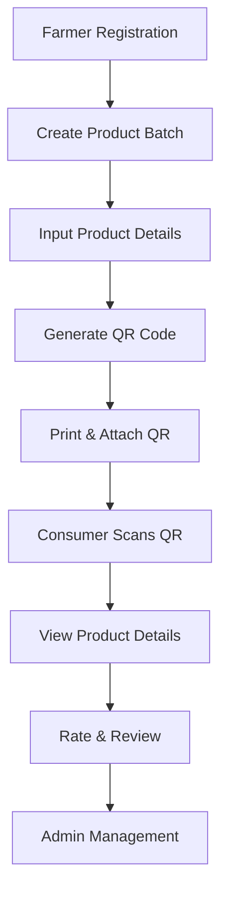

# Welcome to AgriTrace

AgriTrace is a comprehensive agricultural product traceability platform designed specifically for small farmers and cooperatives in Vietnam. Our mission is to bridge the gap between traditional farming practices and modern traceability requirements, enabling farmers to create transparent supply chains for their products.

## 🌾 What is AgriTrace?

AgriTrace is a mobile and web platform that enables farmers to create QR codes for tracing agricultural product origins. Whether it's 20kg mango crates or 5kg vegetable bundles, our platform emphasizes simplicity and low cost, making it suitable for traditional markets and social media sales.

### Key Features

- **Simple QR Code Generation**: Create unique QR codes for each product batch
- **No Complex Technology**: No blockchain, RFID, or IoT required
- **Farmer-Friendly Interface**: Designed with Vietnamese farmers in mind
- **Cost-Effective Solution**: Minimal setup and maintenance costs
- **Mobile-First Design**: Works seamlessly on smartphones
- **Expiration-Based Security**: QR codes expire to prevent reuse

## 🎯 Target Users

### Farmers & Cooperatives
- Small-scale farmers in Vietnam
- Agricultural cooperatives
- Family-owned farms
- Organic farmers

### Consumers
- Local market shoppers
- Social media buyers
- Quality-conscious consumers
- Export market buyers

### Administrators
- Platform managers
- Category administrators
- User management staff

## 🏗️ Technology Stack

### Frontend
- **React Native**: Cross-platform mobile app
- **React.js**: Web dashboard
- **TypeScript**: Type-safe development

### Backend
- **Node.js**: Server runtime
- **Express.js**: Web framework
- **JWT**: Authentication

### Database
- **MySQL/PostgreSQL**: Relational database
- **Sequelize**: ORM for database management

### QR Code System
- **qrcode.js**: QR code generation
- **Camera API**: Native QR scanning
- **Expiration Logic**: Time-based validation

## 🔄 Core Workflow

## 📱 Key Screens

### For Farmers
- **LoginScreen**: Secure authentication
- **DashboardScreen**: Overview of batches
- **CreateBatchScreen**: Add new products
- **QRGenerateScreen**: Generate QR codes
- **BatchListScreen**: Manage existing batches
- **ProfileScreen**: Account management

### For Consumers
- **QRScanScreen**: Scan QR codes
- **ProductDetailScreen**: View product information
- **ReviewScreen**: Rate and review products

### For Administrators
- **AdminDashboardScreen**: System overview
- **UserManagementScreen**: Manage users
- **CategoryManagementScreen**: Product categories
- **PermissionScreen**: Access control

## 🌍 Vietnamese Market Focus

AgriTrace is specifically designed for the Vietnamese agricultural market:

- **Language Support**: Vietnamese and English interfaces
- **Local Payment**: Integration with Vietnamese payment methods
- **Cultural Adaptation**: UI/UX designed for Vietnamese users
- **Regulatory Compliance**: Meets Vietnamese agricultural standards
- **Network Optimization**: Works well with Vietnamese internet infrastructure

## 🚀 Quick Start

Ready to get started with AgriTrace? Check out our [Installation Guide](/Installation) to set up the platform, or explore our [Features](/Features) to learn more about what AgriTrace can do for your agricultural business.

## 📞 Support

Need help? Our team is here to support you:

- **Email**: support@agritrace.vn
- **Phone**: +84 123 456 789
- **GitHub**: [Report Issues](https://github.com/vietvo371/AgriTrace/issues)

---

*AgriTrace - Empowering Vietnamese farmers with modern traceability solutions*
